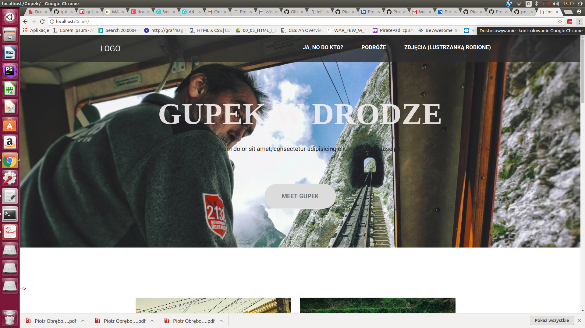

Projekt zaliczeniowy boot-campu CodersLab. 
W ramach zaliczenia zrealizowałem motyw do Wordpressa. 

Wykorzystane technologie to: Html, Css, JavaScript i PHP. 

Do automatyzacji pracy użyłem Gulp i Sass. 

Mapa na stronie zrealizowana dzięki bibliotece amcharts. 

Motyw jest w pełni responsywny.

